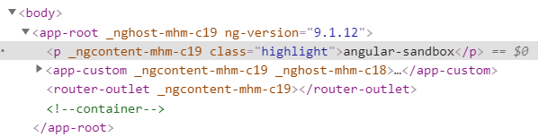
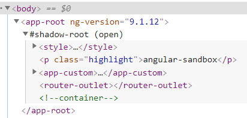

# Module 1. Angular introduction. _Angular-cli_.

## Что такое Angular?

Это фреймворк и платформа, предназначенная для создания SPA любой сложности. Ангуляр разработан в Google, пользуется большой популярностью, имеет хорошую документацию и может похвастаться обширным коммьюнити и поддержкой со стороны разработчиков и пользователей.

Первый релиз был 14 сентября 2016 года. Мажорные релизы с обратной совместимостью происходят 2 раза в год. Последний мажорный релиз (версия 10) состоялся 24 июня 2010 года.
Ангуляр использует TypeScript и RxJS из коробки.

Сам ангуляр и приложения, написанные на нём, используют модульность и основаны на паттерне Dependency Injection.
Начиная с 9ой версии, Ангуляр использует Ivy Renderer и Incremental DOM. Подробнее о том, что это и чем отличается от Virtual DOM: https://habr.com/ru/post/448048/

У Ангуляра есть мощный инструмент, который позволяет эффективно работать через командную строку. Это _angular-cli_: https://cli.angular.io/

Это очень гибкий инструмент, который позволяет через терминал создавать проекты, управлять настройками, добавлять модули, компоненты, сервисы, директивы, пайпы. В _angular-cli_ можно добавлять схемы и таким образом ускорить разработку или просто настроить её под себя, в случае если стандартных команд не хватает.

Чтобы создать проект, необходимо:

- установить _LTE_ версию _Node.js_
- установить Ангуляр глобально `npm install -g @angular/cli`
- `ng new angular-sandbox --routing=true --style=scss`

Обратите внимание, что команда new может помимо имени нового проекта содержать множество других аргументов. Здесь перечислены все: https://angular.io/cli/new#options

Мы создаем новый проект с тестами, роутером и препроцессором scss. Мы не будем менять стандартное значение _--viewEncapsulation_, но рассмотрим его подробнее.

После инициализации проекта в корне создадутся папки и файлы. Подробнее здесь: https://angular.io/guide/file-structure

- _.git/_, _.gitignore_ – для работы с _git_.
- _e2e/_ – для end-to-end тестов. Ангуляр использует библиотеку protractor для работы с такими тестами. Изначально разработанный для тестирования в связке с _AngularJS_, он до сих пор используется для написания автотестов. Внутри этой папки хранятся все автотесты.
- _node_modules/_, _package.json_, _package-lock.json_ – зависимости. Можно открыть _package.json_ и посмотреть зависимости и типы.
- _src/_ – здесь лежат исходники проекта. Подробнее: https://angular.io/guide/file-structure#application-source-files
  - _app/_ – непосредственно здесь лежат модули, компоненты и сервисы.
  - _assets/_ – медиа файлы, используемые приложением.
  - _environments/_ – здесь описаны среды. По умолчанию dev и prod. При необходимости можно добавить новые. В зависимости от выбранной команды при запуске или сборке приложения будет выбираться та или иная среда. Подробнее: https://indepth.dev/becoming-an-angular-environmentalist/
  - _favicon.ico_ – иконка.
  - _index.html_ – _index_ файл. В body лежит тег `<app-root></app-root>`.
  - _main.ts_ – входная точка приложения.
  - _polyfills.ts_ – полифиллы для старых браузеров. Можно раскомментировать и обеспечить поддержку для них.
  - _styles.scss_ – здесь можно держать глобальные стили.
  - _tests.ts_ – входная точка для тестов.
- _.editorconfig_ – универсальный файл с настройками IDE, который учитывается в совершенно разных редакторах.
- **angular.json** – этот файл является своего рода точкой входа. Здесь перечислены проекты (можно добавлять несколько, если есть желание). Для каждого можно настроить _schematics_, префиксы, корневую папку, и для каждого перечислены сборщики (в поле _architect_). Именно здесь происходит настройка сборщиков, сюда добавляются конфигурации тестов, глобальные переопределения стилей, добавлять шрифты и т.д. Подробнее здесь: https://angular.io/guide/workspace-config
- _browserlist_ – файл, в котором перечислен список поддерживаемых браузеров. Используется сборщиком. Просто не трогайте его.
- _karma.conf.js_ – файл конфигурации для юнит-тестов.
- _tsconfig.json_, _tsconfig.app.json_, _tsconfig.spec.json_ – файлы конфигурации _TypeScript_. Глобальный, а также специфичные для приложения и для тестов.
- _tslint.json_ – файл конфигурации линтера.
- Помимо этих файлов могут присутствовать другие, необходимые для работы с вашим окружением.

Подробнее почитать о том, как работает сборщик, можно здесь: https://medium.com/angular-in-depth/angular-cli-under-the-hood-builders-demystified-v2-e73ee0f2d811

Теперь посмотрим на проект.

Чтобы запустить проект, необходимо перейти в корневую папку (где находится _angular.json_) и выполнить команду ng serve. Приложение соберется и откроется по адресу `http://localhost:4200/`

Это стандартная заглушка, которую можно удалить.

Пока что мы использовали только команды new и serve. Чтобы посмотреть полный список, необходимо набрать `ng help`. Или открыть в документации https://angular.io/cli#command-overview

Самые часто востребованные: `generate`, `serve`, `lint`, `build`, `test`.

## Как гонять тесты

Кроме стандартной заглушки в проекте есть пара функций для тестов. Можно попробовать запустить _e2e_ на другом порте, и запустить юнит-тесты.

Если удалить заглушку, то тесты закономерно упадут. Больше мы в рамках этого курса не будем возвращаться к тестам.

## Устройство компонента

Компонент состоит из 4 файлов: компонент (обязательный, остальные не обязательные), темплейт, стили, спека. Вот так выглядит компонент _app_

```ts
import { Component } from "@angular/core";

@Component({
  selector: "app-root",
  templateUrl: "./app.component.html",
  styleUrls: ["./app.component.scss"],
})
export class AppComponent {
  title = "angular-sandbox";
}
```

_@Component_ – это декоратор, который ставится перед классом, чтобы сделать из класса ангуляровский компонент. Он принимает в себя объект определенного типа. Здесь очевидно указаны пути к темплейту и к стилям, кроме того есть _selector_. Именно так будет выглядеть _html_ тэг, привязанный к компоненту. Подробнее смотри про Web Components. Это очень обширная тема и затрагивать её мы не будем.

Внутри класса можно создавать собственные переменные. Например _title_ будет доступна в темплейте. Удалим из темплейта заглушку, добавим такое:

```html
<p class="highlight">{{title}}</p>

<router-outlet></router-outlet>
```

_router-outlet_ пока трогать не надо. Это тег, который работает с выдачей роутера.

Добавим css класс в стили:

```css
.highlight {
  background-color: salmon;
}
```

Помимо этих свойств у декоратора компонента есть множество других. Если перейти в _core.d.ts_, то все эти свойства будут перечислены и описаны. Лучше и проще будет почитать официальную документацию: https://angular.io/api/core/Component

Далеко не все эти свойства нужно настраивать в повседневной жизни. Некоторые стоит рассмотреть подробнее. Именно для компонента это _encapsulation_ и _changeDetection_.
Первое позволяет изолировать стили, а второе более гибко обновлять вью компонента. Обновление вью мы рассмотрим в следующих лекциях. Пока рассмотрим инкапсуляцию.

## Инкапсуляция стилей

Создадим новый компонент ng generate component custom
Было создано 4 файла и обновлен 1. Это темплейт, стили, компонент и спека. Кроме того, этот компонент был добавлен в _app.module.ts_

Чтобы добавить компонент, достаточно добавить тэг app-custom в любой компонент внутри AppModule

```html
<p class="highlight">{{title}}</p>
<app-custom></app-custom>

<router-outlet><router-outlet></router-outlet></router-outlet>
```

**custom works!**

Если добавить класс _.highlight_, то ничего не изменится. По умолчанию стили в ангуляре инкапсулированы. Это происходит, потому что дефолтное значение параметра _encapsulation_ у компонентов _Emulated_. Если поменять его на _Null_ или вынести стили в общий файл _styles.css_, то они применятся.
Вот как это работает. Во-первых, _ViewEncapsulation_ – это _enum_.

```ts
enum ViewEncapsulation {
    Emulated: 0,
    Native: 1,
    None: 2,
    ShadowDom: 3
}
```

При _Emulated_ на элементы добавляется уникальный сгенерированный атрибут. И стили применяются согласно этому атрибуту. Для каждого компонента он уникальный.



Если поменять его таким образом, то атрибут исчезнет и стили класса _.highlight_ будут применяться по всему приложению.

```ts
import { Component, ViewEncapsulation } from "@angular/core";

@Component({
  selector: "app-root",
  templateUrl: "./app.component.html",
  styleUrls: ["./app.component.scss"],
  encapsulation: ViewEncapsulation.None,
})
export class AppComponent {
  title = "angular-sandbox";
}
```



Можно выставить _ShadowDom_, тогда в результате стили будут инкапсулированы с помощью одноименной технологии. Внутри каждого компонента будет изолированный _HTML_ и _CSS_.

Такие классы будут применять стили ко всем _Emulated_ компонентам, в которые попадут. Но не будут применяться к другим _ShadowDom_ компонентам. Имеет смысл использовать _ShadowDom_ по всему проекту, иначе может привести к увеличению энтропии.

Не могу не добавить, что когда я готовил эту лекцию, то забыл убрать _ShadowDom_ инкапсуляцию с `app.component` и не мог понять, почему не подключается _bootstrap_.

Подробнее тут: https://w3c.github.io/webcomponents/spec/shadow/

Мы будем использовать стандартное _Emulated_. В принципе, к инкапсуляции стилей можно больше не возвращаться в рамках данного менторинга.

## Build.

Как вы уже могли заметить, изменения подхватываются автоматически и сразу же отображаются в браузере. Кроме того, в консоли висит сообщение _Angular is running in the development mode_. Если мы хотим сделать бандл, нам придется запустить скрипт сборки.

`npm run build` создаст чудовищную увесистую сборку.

Фактически две сборки и ещё сорс-мапы.

В терминале вы увидите следующее уведомление:

```
Generating ES5 bundles for differential loading...
ES5 bundle generation complete.
```

Чтобы сделать нормальную сборку, необходимо добавить флаг `--prod`.

В таком случае код будет минифицирован, сорс-мапы не будут включены. Весь бандл будет весить в разы меньше. Кроме того, дифференцированная сборка позволит не загружать часть тяжелых полифилов. Если вы откроете приложение в новом браузере, то этот код не подтянется с сервера (он лежит в _es5_ чанках).

Если откроете в легаси браузере, то подтянется.

Далее, когда речь зайдет о роутинге и _lazy-loading_, вы увидите, что ангуляр замечательно справляется с задачей разбиения сборки на мелкие чанки. Это делает приложения очень быстрыми и позволяют экономить трафик.

## AOT vs JIT

Если мы указываем флаг `--prod`, то включается _Ahead of Time_ компиляция. В режиме разработке по умолчанию _Just in Time_. Другими словами приложание компилируется либо в рантайме, что удобно для разработки, либо на сервере, что необходимо для продакшена.

## Линтер.

Чтобы проверить код, можно запустить скрипт `npm run lint`. Настроить линтер можно в файле _tslint.json_.

Например, можно убрать `implements OnInit` и линтер начнет ругаться.

Подробнее о правилах линтера можно посмотреть здесь: https://palantir.github.io/tslint/rules/

Крайне рекомендуется использовать линтер перед каждым коммитом.

## Подключение сторонних библиотек.

Чтобы подключить, например, _bootstrap_, достаточно просто следовать инструкции. С актуальной версией это стало ещё проще: достаточно просто вызвать скрипт `ng add @ng-bootstrap/ng-bootstrap`

Либо же сделать вручную: добавить нужную зависимость в _package.json_, импортировать в _AppModule_ или же добавить в _angular.json_. Как правило сторонние разработчики пишут подробные инструкции и используют схемы, что значительно упрощает установку зависимостей.

Обратите внимание, что `ng add` делает всё автоматически:

```
Installing packages for tooling via npm.
Installed packages for tooling via npm.
UPDATE package.json (1353 bytes)
Packages installed successfully.
UPDATE src/app/app.module.ts (546 bytes)
UPDATE src/styles.scss (155 bytes)
UPDATE src/polyfills.ts (3064 bytes)
```

После этого можно пользоваться стилями и компонентами.

[Список модулей](../modules.md)
