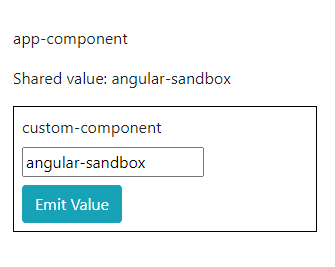

# Module 3. Components interaction. Services.

_@Input_, _@Output_ декораторы

Взаимодействие между компонентами происходит посредством декораторов _@Input_ и _@Output_

https://www.typescriptlang.org/docs/handbook/decorators.html

Согласно документации, Декоратор — это специальный вид описания, который можно присоединить к декларации класса, метода, get свойства, свойства или параметра. Декораторы используют форму _@expression_, то есть при использовании ставится символ `@` перед именем декоратора. Хотя по сути expression может быть любая функция. Эта функция будет вызвана в процессе выполнения программы, причем вызывающий код добавит аргументы с информацией о том объекте, который был задекорирован.

Другими словами, декоратор — это способ добавить дополнительное поведение классу, функции, свойству или параметру. Это можно отнести к парадигме мета-программирования или декларативного программирования.

Важно, что декоратор — это лишь функция. При использовании, среда исполнения сначала вызовет функцию-декоратор, и только потом будет выполнен основной сценарий объекта (если код декоратора содержит этот вызов). При наличии нескольких декораторов, они будет вызваны по очереди, сверху вниз.



Когда компонент инициализируется, в него из родителя можно передать данные. Для этого используется синтаксис, похожий на синтаксис обычного html-атрибута.

_app.component.html_

```html
<p>app-component</p>
<p>Shared value: {{sharedValue}}</p>
<app-custom
  [inputValue]="sharedValue"
  (emitValue)="onEmitValue($event)"
></app-custom>
```

_app.component.ts_

```ts
import { Component } from "@angular/core";

@Component({
  selector: "app-root",
  templateUrl: "./app.component.html",
  styleUrls: ["./app.component.scss"],
})
export class AppComponent {
  public sharedValue = "angular-sandbox";

  public onEmitValue(newValue: string): void {
    this.sharedValue = newValue;
  }
}
```

_custom.component.html_

```html
<p class="m-0">custom-component</p>
<input class="my-2" type="text" [(ngModel)]="inputValue" />
<br />
<button class="btn btn-info" (click)="onClick()">Emit Value</button>
```

_custom.component.ts_

```ts
import { Component, EventEmitter, Input, OnInit, Output } from "@angular/core";

@Component({
  selector: "app-custom",
  templateUrl: "./custom.component.html",
  styleUrls: ["./custom.component.scss"],
  host: {
    class: "p-2",
  },
})
export class CustomComponent implements OnInit {
  @Input() public inputValue;
  @Output() public emitValue = new EventEmmiter<string>();

  constructor() {}

  public onClick(): void {
    this.emitValue.emit(this.inputValue);
  }

  ngOnInit(): void {}
}
```

Здесь работает аналогичный синтаксис, который мы уже видели раньше. `()` – это событие от потомка, `[]` – это передача данных в дочерний элемент.

Можно изменять _sharedValue_ из родительского элемента:

_app.component.html_

```html
<p>app-component</p>
<p>Shared Value: {{sharedValue}}</p>
<input class="my-2" type="text" [(ngModel)]="sharedValue" />
<app-custom
  [inputValue]="sharedValue"
  (emitValue)="onEmitValue($event)"
></app-custom>
```

## @ViewChild, @ViewChildren декораторы

В предыдущей лекции упомянались шаблонные переменные (template reference). Пока они рассматривались исключительно как ссылки на ng-template. Фактически такую ссылку можно дать на любой элемент, в том числе на кастомный элемент. И использовать эти декораторы для связи с дочерним компонентом. Например, с его методами.

Добавим _#appCustom_ рефренс в темплейте родителя, подключим декоратор _@ViewChild_ с именем шаблонной переменной к переменной компонента. Теперь **публичные** методы и свойства потомка будут доступны через вызов в родительском компоненте.

Метод _childMethod()_ будет вызываться из родителя.

_app.component.html_

```html
<p>app-component</p>
<p>Shared Value: {{sharedValue}}</p>
<input class="my-2" type="text" [(ngModel)]="sharedValue" />
<button class="mt-2 btn btn-info" (click)="onCheckAppCustom()">
  Check #appCustom
</button>
<app-custom
  #appCustom
  [inputValue]="sharedValue"
  (emitValue)="onEmitValue($event)"
></app-custom>
```

_app.component.ts_

```ts
import { Component } from "@angular/core";

@Component({
  selector: "app-root",
  templateUrl: "./app.component.html",
  styleUrls: ["./app.component.scss"],
})
export class AppComponent {
  @ViewChild("appCustom", { static: false }) appCustom: CustomComponent;

  public sharedValue = "angular-sandbox";

  public onCheckAppCustom(): void {
    this.appCustom.childMethod();
  }

  public onEmitValue(newValue: string): void {
    this.sharedValue = newValue;
  }
}
```

_custom.component.html_

```html
<p class="m-0">custom component</p>
<input class="my-2" type="text" [(ngModel)]="inputValue" />
<br />
<button class="btn btn-info" (click)="onClick()">Emit Value</button>
```

_custom.component.ts_

```ts
import { Component, EventEmitter, Input, OnInit, Output } from "@angular/core";

@Component({
  selector: "app-custom",
  templateUrl: "./custom.component.html",
  styleUrls: ["./custom.component.scss"],
  host: {
    class: "p-2",
  },
})
export class CustomComponent implements OnInit {
  @Input() public inputValue;
  @Output() public emitValue = new EventEmitter<string>();

  constructor() {}

  public onClick(): void {
    this.emitValue.emit(this.inputValue);
  }

  public childMethod(): void {
    console.log("childMethod triggered");
  }

  ngOnInit(): void {}
}
```

_@ViewChildren_ делает то же самое, но принимает в себя массив из компонентов. Причем этот массив будет представлять собой не совсем массив, а _QueryList_. В таком случае можно обойтись и без шаблонной переменной, а просто выделить ВСЕ вложенные дочерние элементы одного типа.
То есть записи `@ViewChildren('appCustom') appCustomElements: QueryList<CustomComponent>;` и
`@ViewChildren(CustomComponent) appCustomElements: QueryList<CustomComponent>;` будут эквивалентны.

_app.component.html_

```html
<p>app-component</p>
<p>Shared value: {{sharedValue}}</p>
<input class="my-2" type="text" [(ngModel)]="sharedValue" />
<button class="my-2 btn btn-info" (click)="onCheckAppCustom()">
  Check #appCustom
</button>
<app-custom
  #appCustom
  *ngFor="let item of [1,2,3,4,5]"
  [inputValue]="sharedValue"
  (emitValue)="onEmitValue($event)"
></app-custom>
```

_app.component.ts_

```ts
import { Component, QueryList, ViewChildren } from "@angular/core";
import { CustomComponent } from "./custom/custom.component";

@Component({
  selector: "app-root",
  templateUrl: "./app.component.html",
  styleUrls: ["./app.component.scss"],
})
export class AppComponent {
  @ViewChildren("appCustom") appCustomElements: QueryList<CustomComponent>;

  public sharedValue = "angular-sandbox";

  public onCheckAppCustom(): void {
    const appCustomElements = Array.from(this.appCustomElements);
    console.log(this.appCustomElements);
    appCustomElements[0].childMethod();
  }

  public onEmitValue(newValue: string): void {
    this.sharedValue = newValue;
  }
}
```

По сути дела это работа с реальными дом-элементами. Поэтому не стоит стремиться использовать такие декораторы.

## Проекция контента (трансклюдинг), тэг <ng-content>, декораторы @ContentChild и @ContentChildren

Помимо взаимодействия между компонентами в Ангуляре возможно настроить более сложный тип взаимодействия.

Прямо внурть тега кастомного компонента можно передать html код. Если ничего не предпринять, то такой код нигде не отобразится. Но если в дочернем компоненте будет `<ng-content>`, то контент проецируется внутрь этого тега. Соответственно, всё, что в нем будет, будет фактически частью родительского компонента. И доступ к элементам будет осуществляться через _@ContentChild_ или _@ContentChildren_ (разница такая же, как и в первом случае: либо один элемент, либо массив из элементов).

_app.component.html_

```html
<p>app-component</p>
<p>Shared value: {{sharedValue}}</p>
<input class="my-2" type="text" [(ngModel)]="sharedValue" />
<button class="my-2 btn btn-info" (click)="onCheckAppCustom()">
  Check #appCustom
</button>
<app-custom
  #appCustom
  *ngFor="let item of [1,2,3,4,5]"
  [inputValue]="sharedValue"
  (emitValue)="onEmitValue($event)"
>
  <input #parentContent class="m-0" [value]="messageForContent + ' ' + item" />
</app-custom>
```

_app.component.ts_

```ts
import { Component, QueryList, ViewChildren } from "@angular/core";
import { CustomComponent } from "./custom/custom.component";

@Component({
  selector: "app-root",
  templateUrl: "./app.component.html",
  styleUrls: ["./app.component.scss"],
})
export class AppComponent {
  @ViewChildren("appCustom") appCustomElements: QueryList<CustomComponent>;

  public sharedValue = "angular-sandbox";
  public messageForContent = "This is a number";

  public onCheckAppCustom(): void {
    const appCustomElements = Array.from(this.appCustomElements);
    console.log(this.appCustomElements);
    appCustomElements[0].childMethod();
  }

  public onEmitValue(newValue: string): void {
    this.sharedValue = newValue;
  }
}
```

_custom.component.html_

```html
<p class="m-0">custom-component</p>
<input class="my-2" type="text" [(ngModel)]="inputValue" />
<br />
<button class="my-2 btn btn-info" (click)="onClick()">Emit Value</button>
<br />
<button class="my-2 btn btn-info" (click)="checkParentContent()">
  Check Transcluded Content
</button>
<br />
<ng-content></ng-content>
```

Проецирование контента – довольно мощный инструмент. Пригодится может, если вы захотите написать свою библиотеку с компонентами. Позволяет делать жесткую верстку, используя специальные селекторы и директиву _ngProjectAs_. Лично мне было полезно, когда я создавал много похожих модальных окон.

Подробнее тут: https://habr.com/ru/post/491136/

Вы только что получили подробную инструкцию, как стрелять себе в ногу. Постарайтесь обойтись без таких обращений к методам дочерних компонентов, без проецирования контента. Как правило всегда достаточно декораторов _@Input_() и _@Output_().

## Использование

_Angular pipe_, или просто фильтр, нужен для преобразования данных прямо в HTML-шаблоне. Например, отображение даты и времени в желаемом формате или задание формата вывода числового значения.

Angular содержит ряд встроенных pipe’ов. Например: DatePipe, CurrencyPipe, JsonPipe. Полный список здесь - https://angular.io/api?type=pipe.

Пример использования встроенного pipe’а:

```ts
@Component({
  selector: "async-observable-pipe",
  template:
    "<div><code>observable|async</code>: Time: {{ time | async }}</div>",
})
export class AsyncObservablePipeComponent {
  time = new Observable<string>((observer: Observer<string>) => {
    setInterval(() => observer.next(new Date().toString()), 1000);
  });
}
```

Pipe’ы можно использовать последовательно:

```html
{{someString | pipe1 | pipe2 | pipe3 | ... }}
```

## Жизненный цикл компонентов

Взаимодействие между компонентами неизбежно приводит к необходимости понимания жизненного цикла компонентов. Подробно про них написано здесь: https://angular.io/guide/lifecycle-hooks#lifecycle-event-sequence

Все эти этапы жизненного цикла имеют непосредственное отношение к тому, о чем мы только что говорили. Помимо этого здесь есть `ngOnDestroy()`, который вызывается, когда компонент перестает существовать.
