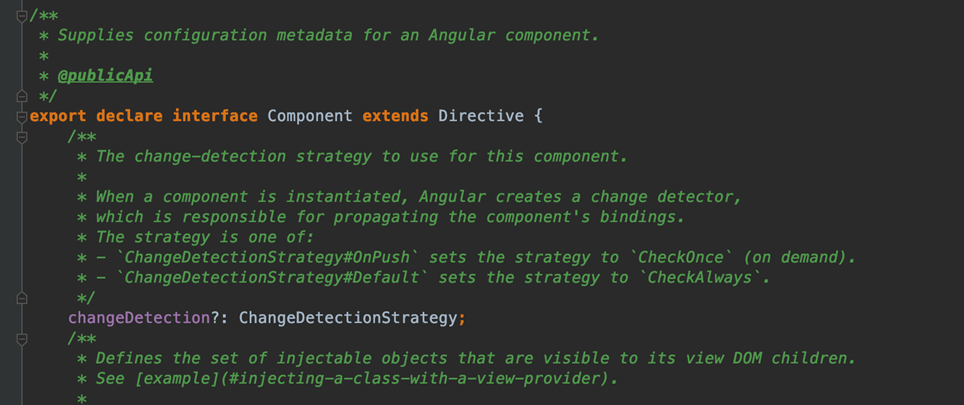
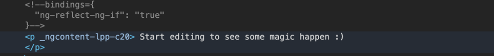
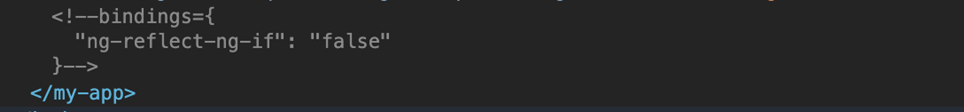
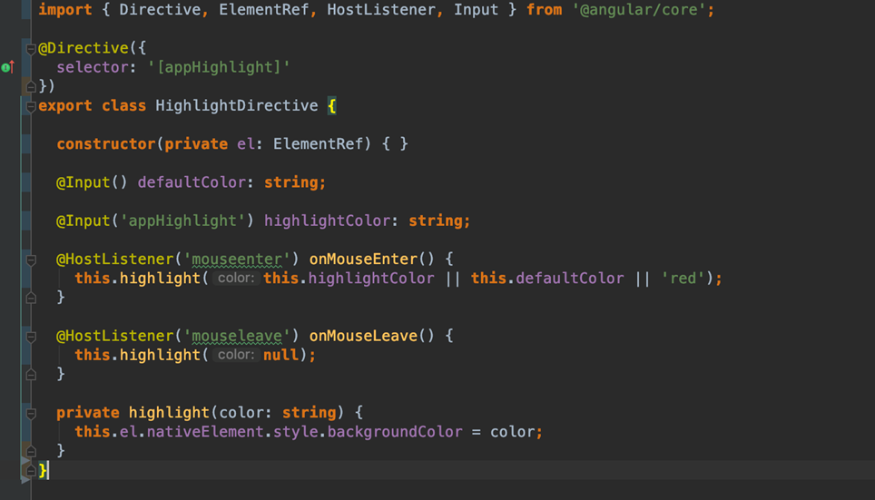
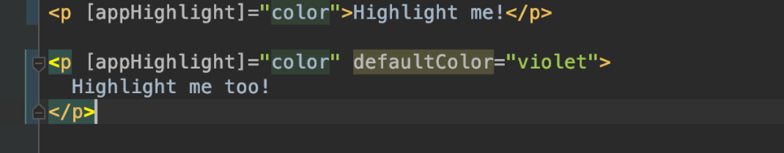
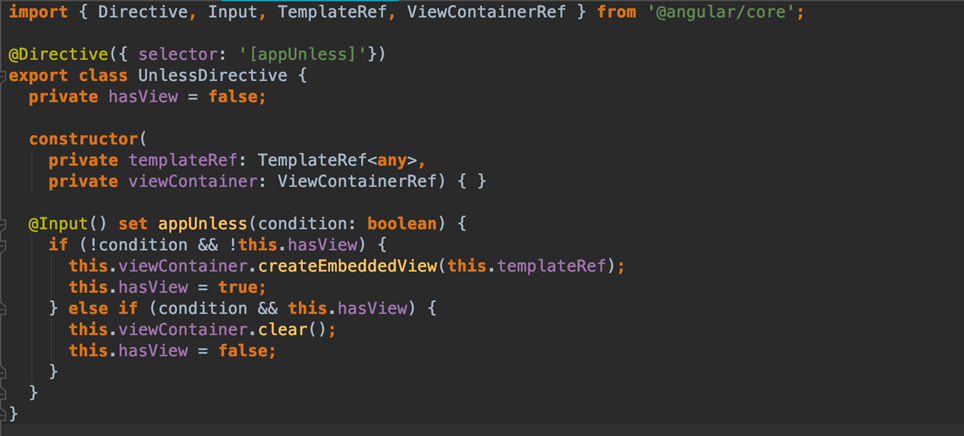
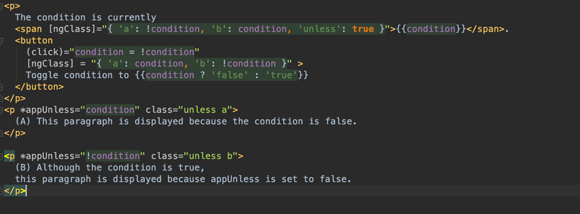

# Directives (structural and attributive) 

В предыдущих лекциях мы много говорили о компонентах. В рамках этой лекции мы будем говорить о директивах. Директивы - это декораторы, который отмечает класс как директиву Angular. Angular представляет 3 типа директив: 

* Components - на самом деле компонент - это директива в которой добавлена функциональность для работы с темплейтами. В этом можно будет убедиться если посмотреть в код Angular. 



* Структурные директивы - изменяют представление,  добавляя и удаляя элементы DOM. 

* Атрибутивные директивы - изменяют внешний вид или поведение элемента, компонента или другой директивы. 

В первую очередь хотелось бы упомянуть, что Angular представляет множество директив из коробки, давайте быстро рассмотрим основные из них. 

## Структурные директивы: 

*NgClass* - добавляет или удаляет один или более *css* классов. 

```html
<div [ngClass]="isSpecial ? 'special' : ''">This div is special</div>
```

*NgStyle* - используется для одновременной и динамической установки множества встроенных стилей в зависимости от состояния компонента. 
 
```html
<div [style.font-size]="isSpecial ? 'x-large' : 'smaller'"> 
  This div is x-large or smaller. 
</div> 
```

Мы видим, что все очень просто. Примерами структурных директив могут служить. 

```html
<button *ngIf="isActiveBtn">Купить</button>
```

*NgIf* - позволяет добавлять или удалять элемент из DOM в соответствии с условием. 

Важно обратить внимание, что мы видим префикс **звездочки `(*)`** в названии директивы. Это синтаксический сахар, который говорит html код элемента меняется. Внутренне Angular переводит атрибут `*ngIf` в элемент `<ng-template>`, обернутый вокруг хост-элемента. 

```html
<ng-template [ngIf]="isVisible">
    <div class="name">{{name}}</div>
</ng-template>
```

`<ng-template>` - это элемент Angular для рендеринга HTML. Он никогда не отображается напрямую. Фактически, перед рендерингом представления Angular заменяет `<ng-template>` и его содержимое комментарием. Если нет структурной директивы и вы просто оборачиваете некоторые элементы в `<ng-template>`, эти элементы исчезают.  



Так же мы можем убедиться, что элемент DOM будет действительно удален: 



Если необходимо просто скрыть элемент можно использовать такой подход: 

```html
<div [class.hidden]="isVisible">Hide with class</div>
<div [style.display]="isVisible ? 'none' : 'block'">Hide with style</div>
```

Но, этот элемент и все его потомки остаются в DOM. Все компоненты для этих элементов остаются в памяти, и Angular может продолжать проверять наличие изменений. 

## `<ng-container>`

Также, мы можем использовать `<ng-container>` - это группирующий элемент, который не мешает стилям или макету, потому что Angular не помещает его в DOM. 

```html
<p>
    I turned the corner
    <ng-container *ngIf="isVisible">
        and saw {{hero.name}}. I vawed
    </ng-container>
    and continued on my way.
</p>
```

*NgFor* - позволяет перебрать в шаблоне элементы массива. 

```html
<div *ngFor="let item of items”>{{item.name}}</div> 
```

Так же мы можем получить индекс элемента таким способом: 

```html
<div *ngFor="let item of items; let i=index">{{i + 1}} - {{item.name}}</div>  
```

Мы можем столкнуться с ситуацией когда нужной нам директивы нет. Что же делать? Просто создать свою кастовую директиву. Angular предоставляет эту возможность. 



## Создание атрибутивной директивы

Создание атрибутивной директивы рассмотрим на примере *highlight*: 

Скобки `([])` делают его атрибутивным селектором. Angular находит каждый элемент в шаблоне, который имеет атрибут с именем *appHighlight*, и применяет логику этой директивы к этому элементу. 

*ElementRef* используешься в конструкторе Директивы для того, что бы внедрить (заинджектить) ссылку на основной элемент DOM к которому применяется данная директива. *ElementRef* предоставляет прямой доступ к элементу DOM узла через его свойство *nativeElement*.

Декоратор *HostListener* используешься для того, что бы зарегистрировать два обработчика событий, которые будет вызываться когда мы наводим или убираем мышь с этого элемента. 

С помощью декоратора *Input* можно передавать дополнительные параметры. 





## Структурная директива

Рассмотрим создание структурной директивы 

Простая структурная директива, подобная этой, создает встроенное представление из сгенерированного Angular `<ng-template>` и вставляет это представление в контейнер представления рядом с исходным элементом хоста `<p>` директивы. 

Вы получите содержимое `<ng-template>` с помощью *TemplateRef* и получите доступ к контейнеру представления через *ViewContainerRef*.  

Метод *createEmbeddedView* создает экземпляр встроенного представления и вставляет его в этот контейнер. 

